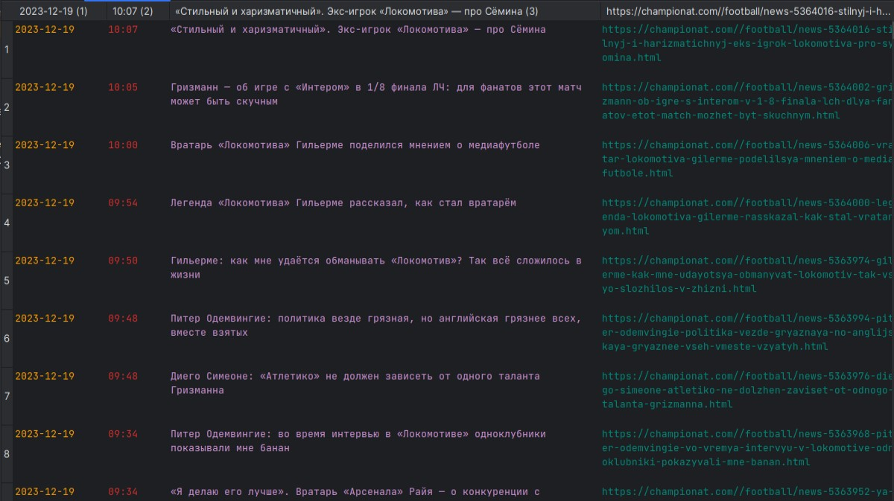

      

## About

Exploring the capabilities of the bs4 (Beautiful Soup) library for parsing HTML pages using the ability to save data to a CSV file.
Also contains the ability to automatically run the parser on a schedule (Schedule Library).

Pages are used as a target:

The largest football news portal in Russia (https://www.championat.com/news/football/1.html)

## How to use
Clone the repository and open it in IDE (or terminal) and enter the command to run the script:

>python main.py

Then you can check the "data.csv" file in the directory of the project.

For launch the sheduler use this command:

>python sheduler.py

The default CSV file update time is once per hour.

## Important

Use virtual environment and install the dependencies that project requires.

>pip install -r requirements.txt

## Developers

- [Ilya Borisov](https://github.com/IamSonic17)